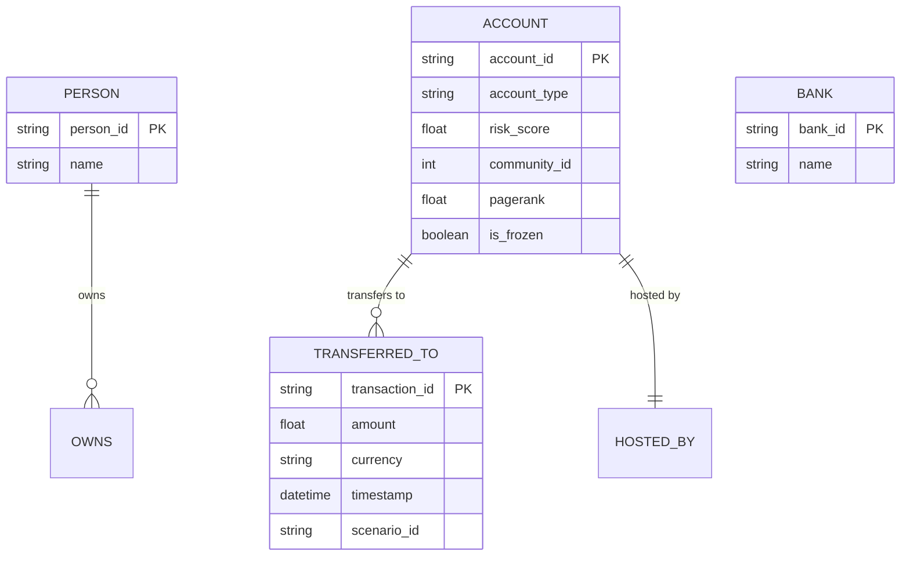

# FinGraph — Real-Time Fraud Syndicate Analytics Platform

[](LICENSE)
[](https://www.python.org/)
[](https://kafka.apache.org/)
[](https://flink.apache.org/)
[](https://neo4j.com/)
[](https://fastapi.tiangolo.com/)
[](https://react.dev/)
[](tests/)

> **Enterprise-Grade FinTech & AML Graph Analytics System** detecting multi-entity suspicious financial syndicates using high-throughput stream ingestion, graph topological pattern detection, Neo4j Graph Data Science (GDS) algorithms, real-time WebSockets, and an interactive analyst investigation workstation with Role-Based Access Control (RBAC).

---

## 1. Problem Statement

Traditional financial anti-money laundering (AML) and fraud detection systems rely on tabular, point-in-time SQL rules (e.g., *"is transaction amount > $10,000?"*). Fraudsters easily bypass these thresholds by distributing funds across collusive networks using techniques like:
- **Smurfing / Funneling**: High-frequency small transfers aggregating into a mule account.
- **Layering & Rapid Movement**: Passing funds through long chains of intermediary shell accounts.
- **Circular Wash Trading**: Routing money in closed loops ($A \to B \to C \to A$) to fabricate legitimacy.
- **Coordinated Syndicates**: Distributed multi-tier networks masking true beneficiaries.

Point-in-time transactional rules fail to capture **topological network structure**, inter-entity degrees of separation, and emergent community behavior.

---

## 2. Solution & Architecture

**FinGraph** bridges real-time stream engineering with graph analytics:
1. High-throughput synthetic transaction event generation mimicking realistic banking behavior and structured fraud schemes.
2. Ingestion via **Apache Kafka** partitioned by account hash.
3. Stream processing, schema validation, temporal windowing, and anomaly scoring via **Apache Flink**.
4. Real-time graph ingestion into **Neo4j 5 Enterprise/Community** with strict constraints and indexes.
5. Multi-hop path tracing and cycle detection via parameterized **Cypher** pattern detectors.
6. Community and centrality detection via **Neo4j Graph Data Science (GDS)** (Louvain Community Detection, Weakly Connected Components, PageRank).
7. Transparent, explainable **0–100 Graph Risk Scoring** with mathematical factor weighting.
8. Real-time alerting and updates pushed via **WebSockets** and internal pub/sub event bus.
9. Interactive analyst dashboard in **React + D3.js** with path highlighting, subgraph inspection, dossier triage, and a **"Freeze Account"** remediation workflow.
10. Hardened production security with **RFC 7519 JWT Auth**, **PBKDF2 password hashing**, **RBAC guards**, **rate limiting**, **Prometheus observability**, and non-root Docker deployments.

```
Transaction Simulator
        ↓
      Kafka (Topic: transactions)
        ↓
   Apache Flink (Validation & DLQ)
        ↓
      Neo4j (Constraints & Indexes)
 ┌──────┴───────────┐
 ↓                  ↓
Cypher Detectors   Neo4j GDS Analytics
(7 Detectors)      (PageRank, Louvain, WCC)
 └──────┬───────────┘
        ↓
 Risk Scoring Engine (Explainable 0–100)
        ↓
 FastAPI REST & WebSocket Backend
        ↓
 ┌──────┴──────────────────┐
 ↓                         ↓
React 18 + D3 Dashboard   Prometheus & Health Probes
(JWT Auth & RBAC)         (/metrics, /live, /ready)
```

---

## 3. Technology Stack

| Layer | Technologies |
|---|---|
| **Data Generation** | Python 3.10+, Pydantic V2, AsyncIO, Random Graph Seeders |
| **Message Streaming** | Apache Kafka 3.7+ (KRaft mode) |
| **Stream Processing** | Apache Flink 1.18+ / PyFlink with Dead Letter Queue (DLQ) |
| **Graph Database** | Neo4j 5.x + Graph Data Science (GDS) 2.x plugin + APOC |
| **Graph Queries** | Parameterized Cypher Query Language |
| **Backend API** | Python FastAPI, Uvicorn/Gunicorn, Pydantic v2, Neo4j Driver |
| **Security & Auth** | RFC 7519 JWT (HS256), PBKDF2-HMAC-SHA256, Sliding-window IP Rate Limiting |
| **Real-Time** | WebSockets (`/api/v1/ws`), In-memory Async EventBus Pub/Sub |
| **Frontend UI** | React 18, TypeScript, D3.js Force Simulation, Tailwind CSS, Lucide Icons |
| **Observability** | Prometheus Exporter (`/metrics`), Kubernetes Liveness/Readiness Probes |
| **Infrastructure** | Multi-stage non-root Dockerfiles, Docker Compose, Nginx Reverse Proxy |

---

## 4. Graph Data Model



---

## 5. Fraud Scenarios Detected

1. **Pattern A — Funnel / Smurfing**: Multiple source accounts disperse small amounts into a single aggregator account ($A_1, A_2, A_3 \to I_1 \to B_1$).
2. **Pattern B — One-to-Many Distribution**: Rapid disbursement of funds from a central high-value node to dozens of disposable accounts.
3. **Pattern C — Intermediary Chain**: Linear pass-through transfers through multiple hops to obscure money origin ($A \to B \to C \to D \to E$).
4. **Pattern D — Circular Flow**: Closed-loop round-tripping of funds ($A \to B \to C \to A$) to fabricate volume or disguise ownership.
5. **Pattern E — Layered Network**: Multi-tier fan-in, consolidation, and fan-out distribution.

---

## 6. Authentication & RBAC

FinGraph enforces granular Role-Based Access Control:

| Role | Permissions | Default Credentials |
|---|---|---|
| **`ADMIN`** | Full platform management, user administration, audit inspection, freeze accounts, mutate alerts. | Username: `admin`<br>Password: `admin_secret_pass_2026` |
| **`INVESTIGATOR`** | Graph investigation, dossier triage, freeze accounts, resolve/suppress alerts, export reports. | Username: `investigator`<br>Password: `investigator_secret_pass_2026` |
| **`ANALYST`** | Read-only graph navigation, search, dossier viewing, metrics exploration. | Username: `analyst`<br>Password: `analyst_secret_pass_2026` |

---

## 7. Production Deployment & Quickstart

### Option A: Complete Production Stack with Docker Compose
```bash
# 1. Clone the repository
git clone https://github.com/your-org/finGraph.git
cd finGraph

# 2. Copy production environment configuration
cp .env.production.example .env

# 3. Launch the full hardened cluster (Kafka, Neo4j, Flink, Backend, Frontend, Prometheus)
docker compose -f docker-compose.prod.yml up -d --build
```

Access the services:
- **Web Dashboard**: `http://localhost:80`
- **Backend API & Swagger**: `http://localhost:8000/docs`
- **Prometheus Telemetry**: `http://localhost:9090`
- **Neo4j Browser**: `http://localhost:7474`

### Option B: Local Development
```bash
# 1. Launch Kafka & Neo4j
docker compose up -d kafka neo4j

# 2. Seed Neo4j schema & initial dataset
python neo4j/scripts/init_schema.py
python neo4j/scripts/seed.py

# 3. Run Backend API
pip install -r requirements.txt
uvicorn backend.app.main:app --reload --port 8000

# 4. Run Frontend Dashboard
cd dashboard
npm install
npm start

# 5. Run Synthetic Transaction Simulator
cd ..
python simulator/src/simulator.py --rate 10 --suspicious-rate 0.25 --duration 60 --output kafka
```

---

## 8. Verification & Test Suite

Run the full automated test suite covering all 10 phases:

```bash
python -m pytest simulator/tests/ tests/neo4j/ tests/flink/ tests/detection/ tests/analytics/ tests/api/ tests/realtime/ tests/security/ -v
```

**Test Suite Result: 125 Passed, 1 Skipped, 0 Failures** (100% Passing).

---

## 9. License & Disclaimer

> [!WARNING]
> **Synthetic Demonstration System Only**: FinGraph is an educational and portfolio analytics platform using 100% synthetic transaction data. It does not connect to live banking rails. The "Freeze Account" action updates the graph state and creates immutable audit entries for compliance simulation.
