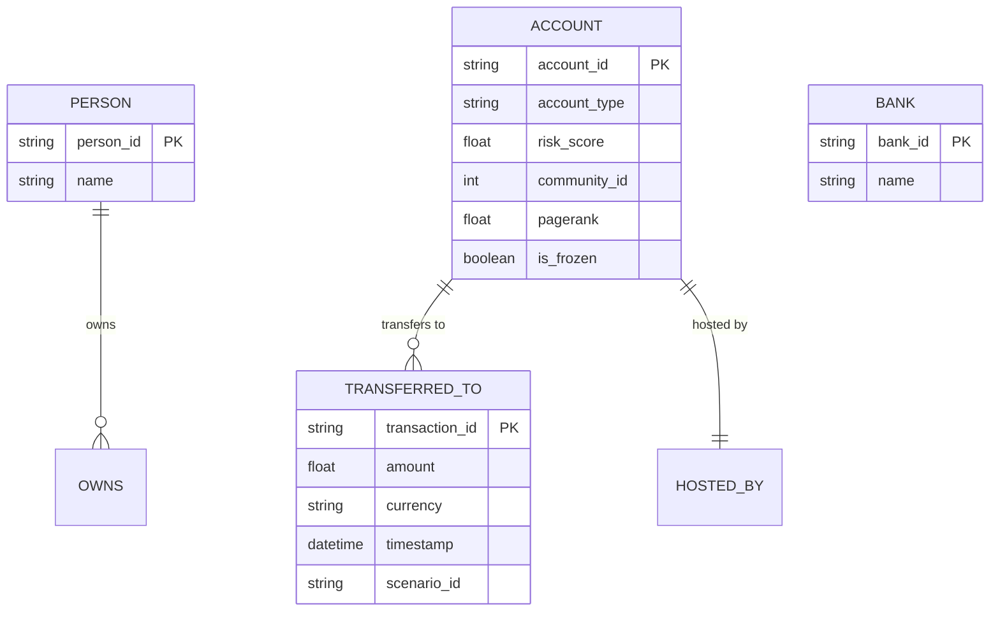

# FinGraph (v1.0.0 Production Release)

> Enterprise Real-Time Fraud Intelligence, Graph Analytics & Autonomous Operations Platform.

[](LICENSE)
[](https://www.python.org/)
[](https://kafka.apache.org/)
[](https://flink.apache.org/)
[](https://neo4j.com/)
[](https://fastapi.tiangolo.com/)
[](https://react.dev/)
[](tests/)

> **Enterprise-Grade FinTech & AML Graph Analytics System** detecting multi-entity suspicious financial syndicates using high-throughput stream ingestion, graph topological pattern detection, Neo4j Graph Data Science (GDS) algorithms, real-time WebSockets, cryptographic case management with SHA-256 evidence vaults, automated fraud network discovery, windowed behavioral anomaly detection, and normalized ML-ready feature generation with an interactive analyst workstation.

---

## 1. Problem Statement

Traditional financial anti-money laundering (AML) and fraud detection systems rely on tabular, point-in-time SQL rules (e.g., *"is transaction amount > $10,000?"*). Fraudsters easily bypass these thresholds by distributing funds across collusive networks using techniques like:
- **Smurfing / Funneling**: High-frequency small transfers aggregating into a mule account.
- **Layering & Rapid Movement**: Passing funds through long chains of intermediary shell accounts.
- **Circular Wash Trading**: Routing money in closed loops ($A \to B \to C \to A$) to fabricate legitimacy.
- **Coordinated Syndicates**: Distributed multi-tier networks masking true beneficiaries.

Point-in-time transactional rules fail to capture **topological network structure**, inter-entity degrees of separation, and emergent community behavior.

---

## 2. Solution & Architecture

**FinGraph** bridges real-time stream engineering with graph analytics:
1. High-throughput synthetic transaction event generation mimicking realistic banking behavior and structured fraud schemes.
2. Ingestion via **Apache Kafka** partitioned by account hash.
3. Stream processing, schema validation, temporal windowing, and anomaly scoring via **Apache Flink**.
4. Real-time graph ingestion into **Neo4j 5 Enterprise/Community** with strict constraints and indexes.
5. Multi-hop path tracing and cycle detection via parameterized **Cypher** pattern detectors.
6. Community and centrality detection via **Neo4j Graph Data Science (GDS)** (Louvain Community Detection, Weakly Connected Components, PageRank).
7. Transparent, explainable **0–100 Graph Risk Scoring** with mathematical factor weighting.
8. Real-time alerting and updates pushed via **WebSockets** and internal pub/sub event bus.
9. Interactive analyst dashboard in **React + D3.js** with path highlighting, subgraph inspection, dossier triage, and a **"Freeze Account"** remediation workflow.
10. Hardened production security with **RFC 7519 JWT Auth**, **PBKDF2 password hashing**, **RBAC guards**, **rate limiting**, **Prometheus observability**, and non-root Docker deployments.
11. **Phase 11 Advanced Fraud Intelligence & Case Management**: End-to-end investigation case lifecycle (`OPEN` $\to$ `IN_PROGRESS` $\to$ `ESCALATED` $\to$ `RESOLVED` $\to$ `CLOSED`), cryptographic evidence vault with SHA-256 integrity digests, unified multi-source chronological forensic timelines, syndicate alert correlation, and prescriptive next-step recommendations.
12. **Phase 12 Fraud Network Intelligence, Behavioral Anomaly & ML-Ready Analytics**: Automated discovery of collusive fraud rings and Louvain community syndicates, transparent 5-factor network risk scoring ($0-100$), member role inference (`ORIGINATOR`, `AGGREGATOR`, `DISPERSER`, `MULE`, `INTERMEDIARY`), 1-click case promotion, windowed behavioral anomaly detection (`5m`, `1h`, `24h`, `7d`, `30d`), multi-signal suspect entity similarity, and normalized 18-signal ML feature store generation with batch CSV/JSON export.

```
Transaction Simulator
        ↓
      Kafka (Topic: transactions)
        ↓
   Apache Flink (Validation & DLQ)
        ↓
      Neo4j (Constraints & Indexes)
 ┌──────┴───────────┐
 ↓                  ↓
Cypher Detectors   Neo4j GDS Analytics
(7 Detectors)      (PageRank, Louvain, WCC)
 └──────┬───────────┘
        ↓
 Explainable Risk Engine (0–100 Scoring & Evidence)
        ↓
 Phase 11 & 12 Intelligence, Syndicate Discovery & Behavioral Store
 (Syndicates, Baselines, Windowed Anomalies, Cases, Timelines, ML Store)
        ↓
 FastAPI REST & WebSocket Backend
        ↓
 ┌──────┴──────────────────┐
 ↓                         ↓
React 18 + D3 Dashboard   Prometheus & Health Probes
(Networks, Cases, Graphs) (/metrics, /live, /ready)
```

---

## 3. Technology Stack

| Layer | Technologies |
|---|---|
| **Data Generation** | Python 3.10+, Pydantic V2, AsyncIO, Random Graph Seeders |
| **Message Streaming** | Apache Kafka 3.7+ (KRaft mode) |
| **Stream Processing** | Apache Flink 1.18+ / PyFlink with Dead Letter Queue (DLQ) |
| **Graph Database** | Neo4j 5.x + Graph Data Science (GDS) 2.x plugin + APOC |
| **Graph Queries** | Parameterized Cypher Query Language |
| **Backend API** | Python FastAPI, Uvicorn/Gunicorn, Pydantic v2, Neo4j Driver |
| **Security & Auth** | RFC 7519 JWT (HS256), PBKDF2-HMAC-SHA256, Sliding-window IP Rate Limiting |
| **Real-Time** | WebSockets (`/api/v1/ws`), In-memory Async EventBus Pub/Sub |
| **Case & Evidence Vault** | SHA-256 Cryptographic Digests, State Machine Engine, Unified Timelines |
| **Frontend UI** | React 18, TypeScript, D3.js Force Simulation, Tailwind CSS, Lucide Icons |
| **Observability** | Prometheus Exporter (`/metrics`), Kubernetes Liveness/Readiness Probes |
| **Infrastructure** | Multi-stage non-root Dockerfiles, Docker Compose, Nginx Reverse Proxy |

---

## 4. Graph Data Model



---

## 5. Fraud Scenarios Detected

1. **Pattern A — Funnel / Smurfing**: Multiple source accounts disperse small amounts into a single aggregator account ($A_1, A_2, A_3 \to I_1 \to B_1$).
2. **Pattern B — One-to-Many Distribution**: Rapid disbursement of funds from a central high-value node to dozens of disposable accounts.
3. **Pattern C — Intermediary Chain**: Linear pass-through transfers through multiple hops to obscure money origin ($A \to B \to C \to D \to E$).
4. **Pattern D — Circular Flow**: Closed-loop round-tripping of funds ($A \to B \to C \to A$) to fabricate volume or disguise ownership.
5. **Pattern E — Layered Network**: Multi-tier fan-in, consolidation, and fan-out distribution.

---

## 6. Authentication & RBAC

FinGraph enforces granular Role-Based Access Control:

| Role | Permissions | Default Credentials |
|---|---|---|
| **`PLATFORM_ADMIN`** | Global tenant administration, policy governance, quotas, system telemetry, configuration versioning. | Username: `platform_admin`<br>Password: `platform_admin_secret_pass_2026` |
| **`ADMIN`** | Tenant management, user administration, audit inspection, freeze accounts, mutate alerts, manage cases within tenant. | Username: `admin`<br>Password: `admin_secret_pass_2026` |
| **`INVESTIGATOR`** | Graph investigation, dossier triage, freeze accounts, resolve/suppress alerts, create/manage cases, attach evidence. | Username: `investigator`<br>Password: `investigator_secret_pass_2026` |
| **`ANALYST`** | Read-only graph navigation, search, dossier viewing, metrics exploration, view case timelines. | Username: `analyst`<br>Password: `analyst_secret_pass_2026` |

---

## 7. Production Deployment & Quickstart

### Option A: Complete Hardened Production Cluster with Docker Compose
```bash
# 1. Clone the repository
git clone https://github.com/your-org/finGraph.git
cd finGraph

# 2. Copy production environment configuration
cp .env.production.example .env

# 3. Launch the full hardened cluster (Kafka, Neo4j, Flink, Backend, Frontend, Prometheus)
docker compose -f docker-compose.prod.yml up -d --build
```

Access the services:
- **Web Dashboard & Investigation Workspace**: `http://localhost:80`
- **Backend API & Swagger**: `http://localhost:8000/docs`
- **Prometheus Telemetry**: `http://localhost:9090`
- **Neo4j Browser**: `http://localhost:7474`

---

## 8. Verification & Test Suite

Run the full automated test suite covering all 11 phases:

```bash
python -m pytest simulator/tests/ tests/ -v
```

**Test Suite Result: 246 Passed, 2 Skipped, 0 Failures** (100% Passing).

---

## 9. License & Disclaimer

> [!WARNING]
> **Synthetic Demonstration System Only**: FinGraph is an educational and portfolio analytics platform using 100% synthetic transaction data. It does not connect to live banking rails. The "Freeze Account" action updates the graph state and creates immutable audit entries for compliance simulation.

## Phase 13: Real-Time Fraud Operations & Alert Prioritization
- **Deterministic Alert Prioritization**: 4-factor scoring ($0-100$) mapped to `P0_CRITICAL`, `P1_HIGH`, `P2_MEDIUM`, `P3_LOW` with explainability factors.
- **Dynamic SLA Countdown**: Real-time SLA tracking (15m to 24h) with `WITHIN_SLA`, `AT_RISK`, and `BREACHED` states.
- **7-State Triage State Machine**: Strict lifecycle state transitions with RBAC and immutable audit logging.
- **Investigator Workspace & Queue**: `AlertQueuePage.tsx`, `InvestigationOperationsPage.tsx`, `FraudOperationsDashboard.tsx`.
- **In-App Notification Center & Unified Search**: Fast multi-entity search and role-scoped in-app notifications with WebSocket push.

### Phase 15: Enterprise Fraud Command Center & Case Intelligence
- **Enterprise Command Center**: Executive KPI overview, active syndicate campaign tracking, and explainable 0–100 Enterprise Fraud Posture Score with driver attribution.
- **Cross-Case Correlation**: Deterministic multi-signal correlation engine matching shared accounts, flow counterparties, topological detectors, and temporal windows.
- **Bounded Case Relationship Graph**: Sub-millisecond D3 force graph synthesis uniting cases, alerts, accounts, transactions, and evidence.
- **Fraud Campaign Discovery**: Clustered multi-case campaigns evaluated via deterministic 6-factor risk scoring and financial exposure quantification.
- **Investigation Collaboration**: Role-based access (`OWNER`, `COLLABORATOR`, `WATCHER`), auditable comments with edit/soft-delete tracking, and immutable append-only activity feeds.

### Phase 16: Advanced Fraud Graph Intelligence, Predictive Risk & Network Evolution
- **Network Evolution & Velocity**: Temporal snapshot comparisons over bounded windows (`5m` to `30d`), hourly activity velocity, and deterministic risk trajectories.
- **Predictive Risk Forecasting**: Time-series risk forecasts across $1\text{h}$, $6\text{h}$, $24\text{h}$, and $7\text{d}$ with explicit historical sufficiency checks.
- **Proactive Early Warnings**: Multi-signal trigger rules, non-destructive recommendations, and investigator lifecycle workflows.
- **Pattern Discovery & Similarity**: Recurring graph motif extraction and deterministic structural similarity matching.
- **Enterprise Threat Level**: Executive composite threat evaluation ($0–100$) and predictive threat forecasting.

### Phase 17: Autonomous Fraud Intelligence & Threat Propagation
- **Autonomous Intelligence**: Continuous detection gap discovery & adaptive detector recommendations.
- **Human Approval Gate**: Strict RBAC lifecycle governance (`PROPOSED` -> `UNDER_REVIEW` -> `APPROVED` -> `DEPLOYED`).
- **Shadow Simulation**: Non-destructive evaluation of candidate detector rules against historical telemetry.
- **Risk Calibration**: 5-bucket empirical outcome matrix vs investigation verdicts.
- **Threat Propagation**: Multi-hop contagion explorer with 6-factor deterministic index and topology visualizer.

### Phase 19: Enterprise Intelligence Orchestration & Investigation Automation
* **Central Intelligence Orchestrator**: Unified facade coordinating detection, risk, networks, evolution, early warnings, and threat propagation.
* **Multi-Signal Alert Correlation**: Explainable linking via shared accounts, devices, proxy subnets, and temporal proximity.
* **Investigation Priority Engine**: 6-factor deterministic priority scoring ($0–100$) and priority bands (`CRITICAL`, `HIGH`, `MEDIUM`, `LOW`).
* **Evidence Tier Ranking**: `STRONG`, `MODERATE`, `WEAK` forensic dossiers with provenance.
* **Automated Investigation Briefs**: Multi-layer dossier synthesis with open questions and "NOT AVAILABLE" fallbacks.
* **Investigation Workflow State Machine**: Validated state progression and case checklists.
* **Investigation Workstations**: React pages for Case Intelligence, Alert Correlation, and Task Management.

### Phase 20: Enterprise Control Plane, Multi-Tenant Architecture & Governance
* **Multi-Tenant Domain Hierarchy**: Strict organizational isolation across Tenants, Organizations, Business Units, Investigation Teams, and Team Members.
* **Deterministic Policy Engine**: Fine-grained access rule evaluation, rule priority ordering, condition matching, and cross-tenant access blocking.
* **Platform Administration Boundary**: Dedicated `PLATFORM_ADMIN` persona managing platform infrastructure and tenants without customer data exposure.
* **Granular Permissions & Extended RBAC**: 19 granular permissions with `require_permission()` factory and tenant-scoped audit logging.
* **Configuration Versioning**: Immutable configuration lifecycle (`DRAFT` -> `ACTIVE` -> `RETIRED`) and tenant lifecycle state machine (`PENDING` -> `ACTIVE` -> `SUSPENDED` -> `DISABLED`).
* **Control Plane REST APIs**: 22 dedicated REST endpoints mounted under `/api/v1/control-plane/*`.
* **Real-time WebSocket Isolation**: Tenant-scoped event envelope filtering and multi-tenant broadcast routing.
* **Enterprise Workstations**: Control Center, Tenant Management, Policy Management, User Management, and Team Management workstations.

